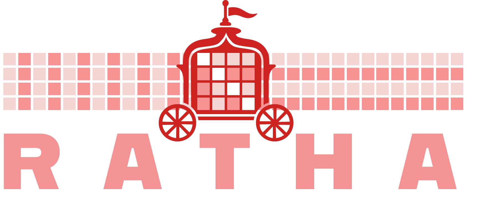

<p align="left">
  
</p>

[](https://solderpad.org/licenses/SHL-0.51/)
[](https://www.apache.org/licenses/LICENSE-2.0)
[](https://github.com/pulp-platform/datamover/actions/workflows/gitlab-ci.yml?query=branch%3Alkesting%2Fkonark)

**Ratha** (formerly Datamover) is a parameterizable HWPE that operates on tensors stored in TCDM, reading from one region and writing back the transformed result to another. Supported transformations are element-wise transpose, mapping a tensor to 'CIM layout', a blocked layout with 64 elements consumed by the Surya accelerator, and unfold/fold for MobileViT-style convolutions. This repository contains the SystemVerilog RTL, a Python golden model, and a RISC-V core driven testbench with JSON-defined test suites.

## 🚀 Quick Start

```bash
uv sync --python 3.11
source .venv/bin/activate
bender-0.31.0 checkout
make run-all-tests
```

`make run-all-tests` auto-loads the `riscv` env wrapper; single-test invocations must be prefixed with `riscv` manually.

## Repository Structure

- `rtl/` — `datamover_top{_wrap}.sv`, `datamover_engine.sv`, `datamover_streamer.sv`, `datamover_package.sv`
- `rtl/ctrl/` — SystemRDL register map (`datamover_regif.rdl`), control wrapper around `hwpe_ctrl_target` + regif + job FSM (`datamover_ctrl.sv`), and the generated register file (`regif/`)
- `scripts/` — register-interface generation from the RDL (`gen_regif.sh`)
- `verif/` — Ibex-driven testbench (`verif/tb/`) and Python golden model (`verif/python/datamover_golden_model.py`)
- `sw/` — C HAL and bare-metal driver (`hal_datamover.{c,h}`, `tb_datamover.c`)
- `utils/` — JSON test suites, `hw_configs.json`, `gen_workload_header.py`, `run_test.py`
- `modelsim/` — simulation infrastructure; per-test builds land in `build_<TEST_NAME>/`

## Hardware Parameters

Set via `config.mk` defaults or per-test via `utils/hw_configs.json`:

| Parameter             | Meaning |
|-----------------------|---------|
| `BANDWIDTH`           | Total HWPE↔TCDM port width (bits) |
| `WORD_WIDTH`          | Memory-bank word width (bits) |
| `ELEM_WIDTH`          | Element width (bits) |
| `MISALIGNED_ACCESSES` | Non-power-of-two strobed accesses (RTL path currently disabled) |

**Constraints**: `BANDWIDTH` must divide by `WORD_WIDTH`; `WORD_WIDTH/ELEM_WIDTH` must be a power of two. Transpose only supports `NUM_ELEM_WORD ∈ {2, 4}`; granularity is selected at runtime via `TRANSP_MODE`.

## Operating Modes

| `DATAMOVER_MODE` | Description |
|------------------|-------------|
| 0 | **Copy** — straight-through |
| 1 | **Transpose** — granularity via `TRANSP_MODE` (1/2/4 elements) |
| 2 | **CIM fwd/rev** — blocked layout (blocks of 64), `CIM_MODE` selects direction, `ROW_TILE_SIZE` controls geometry |
| 3 | **CIMT fwd/rev** |
| 4 | **Unfold** (MobileViT) |
| 5 | **Fold** (MobileViT) |

For register layout, see [datamover_package.sv](rtl/datamover_package.sv).

## Running Tests

```bash
# Single test (note: riscv prefix required)
riscv make run-sim-pipeline TEST_JSON=utils/datamover_smoke_tests.json TEST_NAME=COPY_8x8 NO_GUI=1

# A whole suite
make run-test TEST_JSON=utils/datamover_cim_tests.json PARALLEL=8

# A single test by name
make run-test TEST_JSON=utils/datamover_cim_tests.json TEST=<TEST_NAME> NO_GUI=1

# All enabled suites
make run-all-tests PARALLEL=8
```

JUnit/JSON/CSV reports land in `reports/`; each test runs in `modelsim/build_<TEST_NAME>/`. Suites live in `utils/datamover_*_tests.json`; HW configs in `utils/hw_configs.json`. Test entries use `params` (e.g. `DATAMOVER_MODE`, `TRANSP_MODE`, `CIM_MODE`, `ROW_TILE_SIZE`, `SIZE_M`, `SIZE_N`, `SIZE_C`, `COUNT`) and an optional per-test `hw_config`; the name is auto-generated when omitted.

## Cleanup

```bash
make clean        # build artifacts + reports
make clean-all    # also remove .bender
```

## Contributors

- Francesco Conti, University of Bologna (*f.conti@unibo.it*)
- Arpan Suravi Prasad, ETH Zurich (*prasadar@iis.ee.ethz.ch*)
- Sergio Mazzola, ETH Zurich (*smazzola@iis.ee.ethz.ch*)
- Cyrill Durrer, ETH Zurich (*cdurrer@iis.ee.ethz.ch*)
- Lionnus Kesting, ETH Zurich (*lkesting@iis.ee.ethz.ch*)

## License

- *Software*: Apache License Version 2.0 (`LICENSE.sw`)
- *Hardware*: Solderpad Hardware License Version 0.51 (`LICENSE.hw`)
